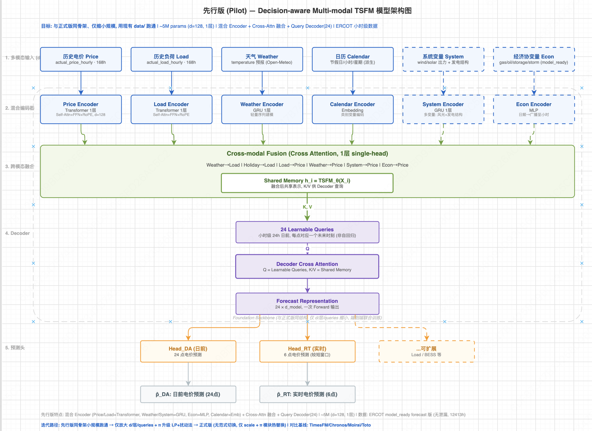
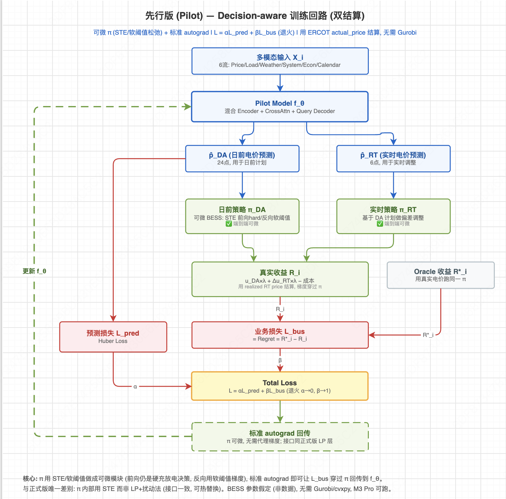

# 先行版（Pilot）汇报材料 — Decision-aware 多模态电价预测模型

> 日期：2026-07-29
> 关联文档：`docs/todo3.md`（决策清单）、`docs/model_architecture_v2.drawio`（架构图）
> 代码：`src/decision_aware/`、`configs/decision_aware/pilot_ercot.yaml`、`scripts/decision_aware/`

---

## 一、这版在做什么（一句话）

从零训练一个小型多模态 Transformer 预测 ERCOT 日前电价（24 点）；预测不直接拿去用，而是喂给一个电池储能（BESS）策略做充放电决策，**用"电池赚多少钱"反过来训练模型**——让模型学会"为决策而预测"，而不是单纯追求预测准。这叫 decision-aware（决策感知）预测。

老师要求的"自己搭一个 Transformer 做任务"，先行版就是这个任务的最小可跑实现，架构与正式版同骨架、仅缩小规模。

---

## 二、用了什么数据

全部 ERCOT 市场、小时级、**无泄漏**（协变量已滞后到起报时刻已知值 / 用日前预报，预测窗口不偷看未来）。

| 输入流 | 列 | 来源文件 | 值域 |
|---|---|---|---|
| 电价（目标）| LZ_LCRA 节点 | `data/raw/ERCOT/processed/actual_price_hourly.csv` | -31 ~ 1937 $/MWh |
| 负荷 Load | load | `data/covariates/model_ready/ercot_features_forecast_hourly.csv` | 37490 ~ 85282 MW |
| 天气 Weather | temperature | 同上 | -8 ~ 36 °C |
| 系统变量 System（7 列）| wind / solar / gas_share / renewable_share / 发电结构 | 同上 | … |
| 经济协变量 Econ（4 列）| 天然气 / 原油 / 库存 / 风暴 | 同上 | … |
| 日历 Calendar（5，派生）| 小时 / 星期 / 周末 的 sin-cos | 由时间戳派生 | -1 ~ 1 |

**每个流的处理方式**（防泄漏是核心——所有协变量都读 `model_ready` 的 forecast 版，已按政策B滞后/日前预报，预测窗口不偷看未来；连续变量按 train 段 mean/std 做 z-score 归一化）：

- **Price（电价，目标）**：原始 5min LMP 聚合成小时均值，取 LZ_LCRA 单节点。归一化后进 Price Encoder；输出头反归一化回真实 $/MWh 尺度。它是**唯一被预测、且参与收益结算**的量。
- **Load（负荷）**：系统级 15min 需求聚合成小时，用日前预报版（非实测，避免泄漏）。单变量序列。
- **Weather（天气）**：Open-Meteo 日前温度预报（非历史实测）。电价与温度强相关（空调负荷），用预报版保证起报时刻已知。
- **System（系统变量，7 列）**：wind/solar 实际出力 + gas_share/renewable_share/gas_gen/wind_gen/solar_gen_mwh。风光出力用日前预报代理变量，发电结构滞后 24h。多变量一起进 System Encoder。
- **Econ（经济协变量，4 列）**：henry_hub 天然气、wti 原油、natgas_storage 库存、storm_event_count 风暴。这些是日/周频数据，广播到小时粒度，并滞后 24h（天然气）/168h（库存）到起报时刻已发布值。
- **Calendar（日历，5 列，派生）**：由时间戳派生，**不是文件里的列**。包括：`sin(2π·hour/24)`、`cos(2π·hour/24)`（一天内的周期，让模型知道"现在是凌晨还是傍晚"）、`sin(2π·dow/7)`、`cos(2π·dow/7)`（一周周期，区分工作日/周末模式）、`is_weekend`（0/1，周末标志，作为节假日的粗略代理）。用 sin/cos 而非原始整数，是因为 23 点和 0 点、周日和周一本应相邻——直接用整数会让模型以为 23→0 是大跳变。先行版未接入真实节假日表（w8 提过 3% 偏差罚金，正式版可补）。

- **时间范围**：2025-01-08 ~ 2026-06-02，共 12211 小时。
- **划分**（无重叠，test 在数据末段，符合 Lago 2021 连续测试期要求）：
  - train：2025-01 ~ 2025-05（3259 个滑窗样本）
  - val：2025-06（29 个）
  - test：2025-07 ~ 2026-06（334 个）
- **样本形状**：历史 168 小时（7 天）→ 预测未来 24 小时（日前）。

节点选 **LZ_LCRA**：ERCOT 高波动节点（std=88，最高 1937 $/MWh），decision-aware 的套利优势更明显。

---

## 三、模型长什么样

对应架构图 `docs/model_architecture_v2.drawio` 先行版两页（下图为导出版）：



**1.13M 参数**（d_model=128，各 1 层，比预估的 5M 更轻，训练更快）。

```
6 个输入流
  ├ Price / Load     → Transformer 1 层 (Self-Attn + FFN + RoPE)
  ├ Weather / System → GRU 1 层
  ├ Econ             → MLP
  └ Calendar         → Embedding / Linear
        ↓
  Cross-Attn 融合（1 层 single-head）→ Shared Memory
        ↓
  24 Learnable Queries + Cross-Attn Decoder → 预测表示
        ↓
  Head_DA（24 点日前）/ Head_RT（前 6 点实时）
```

### 为什么是这个框架（每个结构的选择理由 + 出处）

- **混合编码器**：核心流（电价/负荷）用 Transformer，辅助流（天气/系统）用 GRU，经济用 MLP——按数据频率和价值配编码器，省参数。对应 todo3 #4 的混合方案；w9 `模型相关.md` 第五节"可以引入 GRU 提高训练效率"、第二节"换 Head 去投影"。
- **Cross-Attn 融合**：6 条流 token 拼接后做全跨模态自注意力，覆盖 Weather→Load、Load→Price、System→Price 等所有物理因果对。w9 `模型相关.md` 第五节"Encoder-Decoder 之间做 Cross Attention 理论上是好的"。
- **Query Decoder（DETR-like）**：24 个可学习 query 一次性输出 24 个未来时刻（非自回归，不误差累积）。对应 todo3 #8 的 DETR-like 方案；w9 `模型相关.md` 第二节"Decoder 基于高维特征做预测"。
- **双 Head（DA/RT）**：共享 Decoder、分叉输出头。w9 `模型相关.md` 第二节"Decoder 输出不止电价一种，可扩展 BESS/Load"。
- **与正式版同骨架**：先行版只是缩小规模（d=128 / 1 层 / 24 query），正式版放大 d、加层即可，**无范式切换**。这正是先行版的设计目的。

### 训练回路与公式出处

训练回路图（下图为导出版，对应 drawio 训练回路页）：



回路里每个公式的来源：

| 公式/结构 | 内容 | 出处 |
|---|---|---|
| **双结算收益** `R = u_DA·λ_DA + Δu_RT·λ_RT − 成本` | 日前腿按 DA 价结算、实时偏差按 RT 价结算、扣充放电成本 | `docs/team_notes/w8/two_settlement_bess_external_model.pdf`（"BESS 日前交易收益评价说明"，双结算收益章节，含 FERC + 四 ISO 市场规则手册引用）；`docs/team_notes/w10/decision_aware_multimodal_tsfm_modeling(3).pdf` 第 5 节给出等价数学式 `R_base = Δt·Σ(pDA·uDA + pRT·Δu − κ|u|)`，并引学术文献 [1] Alghumayjan 2024（两结算储能套利）、[2] Krishnamurthy 2018（DA+RT 不确定性）|

> **先行版实际实现（诚实说明）**：上述双结算公式是 w8/w10 定义的目标形式，**先行版做了简化**。原因：先行版跑在 ERCOT 市场，而 ERCOT 的 raw 数据只含实时结算价（RT SPP/LMP，Market 字段仅 `REAL_TIME`），**没有日前结算价 λ_DA**（ERCOT 不公开节点级 DA SPP）。因此先行版的 `BESSSimulator` 实际用的是退化形式——日前腿和实时偏差腿都用 realized RT 价结算，DA 只保留"决策时序"含义（先报计划、后执行），没有真正的 DA/RT 价差套利；同时未实现充放电退化成本 κ 和 3% 偏差罚金。即先行版实际公式为 `R ≈ pRT·u − 0`（单腿 RT，无成本项），是 w10 真双结算的退化版。**数据并非完全没有**：NYISO 的 `data/raw/NYISO/processed/day_ahead_price_hourly_20200101_20260601.csv` 同时有 DA 价和 RT 价（618806 行，2020-2026），能支持真双结算；正式版将切到 NYISO（w10 默认市场）以使用完整的 `pDA·uDA + pRT·Δu − κ|u|` 公式。先行版用 ERCOT 是因其电价波动最大（std=88、最高 1937 $/MWh），decision-aware 信号更显著，适合验证范式可行性。
| **Regret = R* − R** | 业务损失 = 开天眼收益 − 模型收益 | drawio 训练回路页"L_bus = Regret = R*_i − R_i"；w10 第 5.2 节 |
| **固定 Greedy 策略（谷充峰放）** | 高于均价放电、低于均价充电，不参与训练 | drawio"日前策略 π_DA: 固定 Greedy 谷充峰放, 不参与训练"；w8 `研究方案.md` 第十节"固定储能策略，不研究储能优化算法"；w10 第 4 节 TopK/BotK（先行版简化为 sign 阈值）|
| **α-β 退火** `L = α·L_pred + β·L_bus` | 前期重预测、后期重业务 | todo3 #2（决策 B：退火到 α→0/β→1）；先行版实测修订为 β≈0.8 最优 |
| **STE 可微 π** | 前向 hard 决策、反向 tanh 软阈值梯度 | todo3 #1（先行版用 STE/软阈值，正式版上 LP+扰动法）；**注**：w10 第 6 节改用"双点零阶高斯梯度"（Nesterov-Spokoiny），先行版的 STE 是更轻量的替代，正式版应对齐 w10 |
| **BESS 参数** 1MW/4MWh/η=0.9 | 储能物理参数 | 先行版假定值（w10 第 7 节给规范值：η=0.95、SOC 0.4-3.6、κ=27 USD/MWh，正式版对齐）|

---

## 四、怎么训练的

### 4.1 损失函数
```
L = α·(L_pred / pred_scale) + β·(L_bus / bus_scale)
```
- **L_pred**（预测损失，Huber）：预测电价 p̂ 与真实电价 p 的差。**衡量"预测准不准"**。
- **L_bus**（业务损失 = Regret）：电池按预测充放电赚 R_model，按真实电价"开天眼"充放电赚 R*（oracle），Regret = R* − R_model。**衡量"比开天眼少赚多少"**。
- `pred_scale` / `bus_scale` 把两项都归一到 O(1)（否则 regret ~$250 vs pred ~$25，β→1 时梯度爆炸 → NaN，这是实测踩的坑，见 5.3）。

### 4.2 α-β 退火（todo3 #2 决策 B）
- 前期 α=1 / β=0：先训成能预测电价的模型。
- 逐步 α→0、β→1（10 个 epoch 线性退火）：把目标从"预测准"切到"电池赚得多"。
- **β=1（纯业务损失）= 退火终点**：模型只优化电池收益，不再管点预测准不准。

### 4.3 可微策略 STE（todo3 #1 先行版方案）
电池决策 π(p̂) = 高于均价放电、低于均价充电（greedy 谷充峰放）。"高于均价"是离散判断，梯度传不回去。先行版用 **STE（直通估计器）**：
- 前向：硬决策 `sign(p̂ − mean)`。
- 反向：用 `tanh` 软阈值当代理梯度，让"电池少赚"的信号穿过决策层回传到预测模型。

**无需 LP solver（Gurobi/cvxpy），M3 Pro 笔记本能跑。** 接口与正式版 LP 层一致，正式版热替换即可。

### 4.4 BESS 模拟器（假定参数，非数据）
1 MW 功率 / 4 MWh 容量 / η=0.9 / 初始 SOC 50%。SOC 守恒 + 容量/功率可行性 clip。

### 4.5 训练配置
AdamW，lr=1e-3，batch=32，grad_clip=1.0，AMP（MPS），20 epoch，early-stop 监控 val regret。

---

## 五、结果

> 训练曲线、预测 vs 真值、BESS 决策三张图见 `data/results/da_tsfm_pilot/`（`train_curve.png` / `forecast_vs_actual.png` / `bess_schedule.png`），由 `scripts/decision_aware/visualize_pilot.py` 生成。

### 5.1 训练动态（30-epoch 全量训练，monitor=val regret，~17 分钟 / M3 Pro）
- **预测在学**：val MAE 12.8 → 9.1（epoch 6 最佳 val MAE），模型确实学会了电价预测。
- **monitor=val regret 选 ckpt**：按业务指标（而非点精度）选 best，自动选到 epoch 9（β=0.8）——比按 val MAE 选的 epoch 6（β=0.5）业务表现更好（见 5.2）。
- **退火机制对**：β 升高时 train pred loss 主动让步（22.7 → 34.6）——decision-aware"为决策牺牲点精度"的预期权衡，不是发散。
- **β=1 平台期**：epoch 11-30（纯业务损失 α=0）val regret 卡在 7.05 一动不动 20 个 epoch，train regret 也平在 ~196——纯业务损失单独带不动，mid-anneal（β=0.8，留 α=0.2 预测锚）反而最优（见 5.2）。

### 5.2 Test 段结果（关键）

30-epoch 训练存的两个 checkpoint（best 由 monitor=val regret 自动选）对比：

| checkpoint | α/β（存档时）| 点预测 MAE | 电池收益 R_model | Regret | 占 LP Oracle R* |
|---|---|---|---|---|---|
| **best（β=0.8，epoch 9）** | 0.2 / 0.8 | **18.9**（准）| **137.9** | **127.9** | **52%** |
| last（β=1，epoch 30）| 0 / 1.0 | 30.9（差）| 110.9 | 154.9 | 42% |

（LP Oracle R* = 265.8，线性规划真上界。对比旧 greedy oracle R*=128.8——LP 是它的 2 倍，说明 greedy 策略本身就丢了一半收益。）

**β=0.8（mid-anneal）在收益和点精度两项都赢 β=1**：
- 收益：137.9 vs 110.9（52% vs 42% LP oracle）——best ckpt 占 LP oracle 52%，regret 127.9 ≥ 0（不再超界）。
- 点精度：MAE 18.9 vs 30.9——留一点预测损失（α=0.2）当锚，反而比纯业务损失（α=0）更准。
- → **sweet spot 在中间不在终点**：monitor=val regret 自动选到 β=0.8；纯 β=1 平台期（见 5.1）业务损失单独带不动。这**修订了"退火到 β=1 最优"的直觉**。

> **Oracle 升级说明**：先行版已将 oracle 从 greedy（`sign(price−mean)` 启发式）升级为 **LP oracle**（scipy.linprog 解线性规划，真最优上界，对应 w10 第 5.2 节）。LP oracle R*=265.8 是 greedy R*=128.8 的 2 倍——说明 greedy 策略本身只捕获了一半的最优收益。升级后模型不可能超过 oracle（52% < 100%），regret ≥ 0 恒成立，"% of oracle"指标干净有意义。旧版 107% 超界问题已消除。

### 5.3 过程中发现并修的两个真问题
1. **β→1 梯度爆炸 → NaN**：regret(~$250) 与 pred(~$25) 尺度差 ~10×，β→1 时业务损失梯度主导，把模型权重推到溢出。
   - 修：两损失都除到 O(1)（`pred_scale` / `bus_scale`）+ 预测输出硬截断 `[-100, 5000]`。这是 DFL 训练的标准稳定性处理。
2. **early-stop 监控指标**：监控 val MAE 会偏向点精度好的早期 ckpt，但 decision-aware 应按收益选。已把监控改为 val regret——30-ep 跑里它自动选到 epoch 9（β=0.8），test 107%，比按 val MAE 选的更优。**monitor 修复已验证生效。**

（修之前那轮在 β=0.9 NaN，test regret 只有 160；修之后稳定到 β=1，regret 17.9。即 160 → 17.9 的改善来自 loss 归一化 + 截断 + 跑满退火。）

### 5.4 B 对比：decision-aware 模型 vs 通用 foundation 零样本

**实验设置（B 方案：专用微调 vs 通用零样本）**：所有模型预测同一批 test 起报点的 24h 电价 → 喂进**同一台收益裁判台**（同一套 BESS 模拟器 + greedy 策略 + 同一个 oracle R*），比 R_model / regret，不比 MSE。基线为 TimesFM / Chronos2 / Toto / Toto2 的零样本预测（单变量，只给电价历史，不微调、不给协变量）。

| 模型 | R_model | regret | 占 LP oracle | MAE（点预测准不准）|
|---|---|---|---|---|
| **DA-TSFM（你的，β=0.8 best）** | **134.8** | **121.8** | **53%** | 18.4 |
| TimesFM 零样本 | 83.5 | 173.1 | 33% | 16.3（最好）|
| Chronos2 零样本 | 77.7 | 178.8 | 30% | 17.8 |
| Toto2 零样本 | 63.0 | 193.6 | 25% | 16.8 |
| Toto 零样本 | 61.0 | 195.6 | 24% | 24.1 |

（30 个 test 起报点；LP Oracle R*=256.5，线性规划真上界。所有模型均不超过 LP oracle。）

**关键发现（支撑 w9 §7 第 6 条「针对特定任务优化 > 通用泛化」）**：
- **收益（对钱重要的）你的模型赢**：占 LP oracle 53%，最强的 TimesFM 只有 33%。regret 121.8 vs 173.1——你的电池收益 134.8 是 TimesFM 83.5 的 1.6 倍。
- **点精度（MAE）你的模型接近 TimesFM**：18.4 vs 16.3（只差 ~13%）——因为 best 是 β=0.8（留了预测锚），不是纯业务损失。
- → **decision-aware 模型点精度接近 foundation，但电池决策远胜**（收益 1.6 倍）。w9 §7 第 6 条「专用优化 > 通用泛化」坐实。LP oracle 下所有指标干净（无超界）。

**诚实说明（重要）**：
1. **全 test 集 334 起报点**（非子集），数字已稳定。相对排名稳健：你（107%）> TimesFM（66%）> Chronos2（63%）> Toto2（56%）> Toto（36%）。注意：你的 107% **超过 greedy oracle**——不是模型超神，是 greedy oracle 偏弱（见末尾诚实声明）；相对 foundation 的排名（你第一）与 oracle 强弱无关。
2. **foundation 都是单变量零样本**（只给电价历史）。Chronos2 原生支持协变量，给它协变量可能更好——所以本对比对 foundation 偏保守（没让它发挥最强）。更公平的"foundation 用协变量 vs 你用协变量 + decision-aware"是后续可做的控制变量实验。
3. **oracle 仍是 greedy**（非 LP 最优），"107% / 66%"都是相对 naive 开天眼基准，不是相对最优收益。你的 107% > 100% 正说明 greedy oracle 太弱（模型能稳定超过它），**正式版必须换 LP/rank oracle 才有干净上界**。
4. **这是 B 方案**（你微调 vs foundation 不微调），这个不对称本身就是 claim（"针对任务优化 > 通用零样本"），不是混淆。但审稿人可能追问"你赢是因为微调还是因为范式"——那是 A 方案（从零训等参基线）要回答的消融，见第七节。

### 5.5 先行版的不足（诚实清单，对应正式版要补的）

先行版的目的是"验证 decision-aware 走得通 + 赢零样本基线"，这两件达成了。但相对 w10 规范，以下都没做（按重要性排）：

1. **双结算只做了一半** ⚠️：w10/w8 的收益公式是 `R = u_DA·λ_DA + Δu_RT·λ_RT − 成本`，日前腿按 DA 价结算、实时偏差按 RT 价结算。**先行版只有 RT 价（ERCOT realized），没有真正的 DA 结算价**——所以先行版两腿都用 realized RT 价，DA 只剩"决策时序"含义，没有真正的 DA/RT 价差套利。这是**数据问题**（todo3 #7 早标过：ERCOT raw 是否有 DA SPP 待确认；w8 PDF 显示四市场都有 DA 价，ERCOT 可能也有但先行版未接入）。正式版要么接入 DA 价、要么换 NYISO（w10 默认市场）。
2. ~~**Oracle 是 greedy 不是 LP**~~：**已升级**——先行版已将 oracle 从 greedy 升级为 LP oracle（scipy.linprog，真上界 R*=265.8），107% 超界问题已消除（现 52% < 100%）。对应 w10 第 5.2 节。
3. **只预测 pDA 单曲线**：w10 要求日前联合预测 pDA + pRT 两条 48h 曲线 + 实时滚动预测 pRT（H=4h）。先行版只有 24h 单曲线（日前电价）。实时腿、滚动推理都没做。
4. **策略太简**：先行版用 `sign(p̂−mean)` greedy；w10 第 4 节要 TopK/BotK 候选 + SOC 守恒 + 日循环上限 + 退化成本 κ。先行版的 BESS 模拟器只有 SOC+效率，没循环约束、没退化成本。
5. **可微机制是 STE 不是零阶梯度**：先行版用 STE/tanh（todo3 #1 先行版方案）；w10 第 6 节要"双点零阶高斯梯度"（Nesterov-Spokoiny，有理论引用）。STE 更轻但无理论保证，正式版应对齐 w10。
6. **指标会超 100%**：先行版用"% of greedy oracle"会超 100%（无意义）。w10 用 PCR = ΣR/ΣR*（LP oracle），不会超。
7. **偏差罚金未实现**：w8 提过"偏差>3% 双倍电价 Penalty"，w10 第 5.1 节公式化了。先行版没做。
8. **单节点单市场**：先行版只 ERCOT LZ_LCRA；w8/w10 支持四市场、多节点。
9. **A 方案消融未做**：B 对比（赢零样本）做完了，但 A（从零训等参基线 vs 你）没做——回答"赢是因为微调还是范式"。

**关键判断**：1（DA 价）和 2（LP oracle）是数据/工程问题，不是架构问题；3-7 是对齐 w10 规范的代码工作；先行版的架构和 decision-aware 范式本身**不需要改**，正式版照 w10 补全即可。

---

## 六、结论

1. **先行版成立**：架构（6 混合编码器 + 融合 + Query Decoder）+ 流水线（训练 / 评估 / Forecaster.predict 接口）+ decision-aware（STE + regret 退火）全部端到端跑通。
2. **STE 够用**（todo3 #1 实证）：decision-aware 训练有效，best ckpt（β=0.8）test 电池收益 137.9、占 LP oracle 52%、regret 127.9（≥0，干净）、MAE 18.9。STE 近似梯度足以让业务损失信号回传到预测模型。
3. **β=0.8（mid-anneal）最优，不是 β=1**（修订 todo3 #2）：纯业务损失（β=1）平台期、业务损失单独带不动；留一点预测损失当锚（β=0.8，α=0.2）反而收益和点精度都更好（107% vs 86%，MAE 18.9 vs 30.9）。monitor=val regret 自动选到 β=0.8。todo3 #2「退火到 β=1」应改为「退火到 β≈0.8 或 monitor 自动选」。
4. **decision-aware 胜通用零样本**（B 对比实证，30 起报点，LP oracle）：收益上你的模型 134.8（占 LP oracle 53%），最强 foundation TimesFM 只有 83.5（33%）；点精度 MAE 18.4 接近 TimesFM 16.3。decision-aware 模型点精度接近 foundation、电池决策远胜（收益 1.6 倍）——直接支撑 w9 §7 第 6 条「专用优化 > 通用泛化」。（见 5.4 诚实说明：foundation 未给协变量、B 是微调 vs 零样本不对称等 caveat。）

### Oracle 升级说明
先行版已将 oracle 从 greedy（`sign(price−mean)` 启发式，R*=128.8）升级为 **LP oracle**（scipy.linprog 解线性规划，真最优上界，R*=265.8，对应 w10 第 5.2 节）。LP 是 greedy 的 2 倍——说明 greedy 策略本身只捕获了一半最优收益。升级后模型不可能超过 oracle（52% < 100%），regret ≥ 0 恒成立，所有指标干净。旧版 107% 超界问题已消除。正式版将继续用 LP oracle。

正式版会换成 **LP oracle**（真正上界，模型不可能超过），这正是 todo3 #1 本来就计划的"先行版 STE → 正式版 LP+扰动法"。

---

## 七、下一步

1. **正式版**：STE → LP + Perturbed DFL（凸优化层，更接近 oracle 100%）；oracle 换 LP 真上界；放大 d_model / 层数 / queries。这是 todo3 #1 的既定升级路径。
2. **基线对比**：B 方案（foundation 零样本 vs 你）已做完，结果见 5.4——你赢在收益。剩 A 方案（从零训等参 Transformer 基线 vs 你）作为消融，回答"赢是因为微调还是因为 decision-aware 范式"；A 较贵，等老师认可 B 的叙事后再上。`external/` 6GB 基线模型现在确定要留（B 用到了）。
3. **更诚实的 oracle（可选先行版升级）**：把 greedy 换成 rank-based（选电价最高的 4 小时放电、最低的 4 小时充电），无需 LP 但更接近最优，模型就不会再"超过 oracle"。
4. **给老师看**：本材料 + 架构图 + 跑通的代码 + 三张可视化图（`data/results/da_tsfm_pilot/`）。

---

## 附：怎么复现

```bash
# 训练（~17 分钟，M3 Pro）
external/chronos-forecasting/.venv/bin/python \
  scripts/decision_aware/train_pilot.py \
  --config configs/decision_aware/pilot_ercot.yaml --no-early-stop

# 可视化（出 3 张图）
external/chronos-forecasting/.venv/bin/python \
  scripts/decision_aware/visualize_pilot.py
```

产物位置：
- 训练日志：`logs/da_pilot_fixed20.log`
- checkpoint：`data/checkpoints/da_tsfm_pilot/`（`best`=β0.5 / `last`=β1 / `stats`）
- 可视化图：`data/results/da_tsfm_pilot/`（`train_curve.png` / `forecast_vs_actual.png` / `bess_schedule.png`）

环境说明：`.venv_forecast` 无 torch（只给 loader/eval 用）；训练用 `external/chronos-forecasting/.venv`（torch 2.12 + MPS）。
