# 参数消融实验汇报

---

## 一、参数消融是怎么做的

参数消融的核心思路可以用一个词来概括：**转旋钮**。

想象一下，模型面前有一排旋钮，每个旋钮控制一个输入条件——比如"给模型看多少天的历史"、"要不要告诉它天气信息"、"预测多远的未来"。我们每次只转动一个旋钮，其他的全都固定不动，然后看模型的表现怎么变。这样就能精确地知道某个因素到底有多大影响，不会搞混。

在此基础上，我们还引入了 **三个 W（市场窗口）** 的概念：同一个旋钮，在不同的市场环境下效果可能完全不同。所以每个旋钮都要在三种市场状态下各跑一遍。

### 五个旋钮

| 旋钮 | 含义 | 变化范围 |
|---|---|---|
| A - 协变量 | 要不要额外告诉模型天气、负荷、风光发电信息 | 无 → +负荷 → +负荷+温度 → +全部 |
| B - 上下文长度 | 让模型看多少天的历史 | 7天 → 14天 → 30天 |
| C - 多变量 | 每个节点单独预测，还是多节点一起输入 | 单变量 → 多变量 |
| D - 预测步长 | 预测未来多远 | 1天 → 2天 → 7天 |
| F - 数据频率 | 数据的时间粒度 | 1小时 → 15分钟 |

### 三个市场窗口

| 窗口 | 时间段 | 市场特征 | 预测难度 |
|---|---|---|---|
| W1 稳定期 | 2025年8月 | 夏天，价格波动适中 | 最低 |
| W2 负价期 | 2025年3月 | 春天风光多，频繁出现负电价 | 中等 |
| W3 极端期 | 2026年1月 | 冬天寒潮，价格剧烈跳升 | 最高 |

### 基准配置（baseline）

所有旋钮的默认值：频率=1小时，看过去7天，预测未来1天，不加协变量，单变量。每次只把其中一个旋钮拨到别的位置，观察变化。

### 评估体系

我们用两个维度来衡量模型表现：

- **MAE**（平均绝对误差）：整体预测精度，越低越好
- **Spike-F1**：对"价格尖峰"事件的检出能力，越高越好（类似于"能不能提前发现价格暴涨"）

总共 5 旋钮 × 3 窗口 = 15 组实验，每组约 30 个起报点做滚动回测，确保结果稳定可靠。

---

## 二、例子 1：同一旋钮（协变量），在不同市场下效果截然不同

这个例子要说明的是：**一个参数设置在某个市场下有用，换个市场可能没用甚至有害。**

我们把"协变量"旋钮从"不加"拨到"全部加入"（负荷+温度+风光），重点看 Chronos2（它是唯一真正能消费协变量的基础模型）。

### W1 稳定期的结果

| 协变量配置 | Chronos2 MAE | Chronos2 Spike-F1 | Toto2 MAE | Toto2 Spike-F1 |
|---|---|---|---|---|
| 无协变量 | 13.21 | 0.317 | 12.89 | 0.333 |
| +负荷+温度+风光 | **10.68（↓19%）** | **0.417（↑32%）** | 12.89（不变） | 0.333（不变） |

在 W1 稳定期，加入全部协变量后 Chronos2 的 MAE 降了 19%，Spike-F1 从 0.317 升到 0.417——不仅整体预测更准了，对价格尖峰的捕捉能力也明显增强。

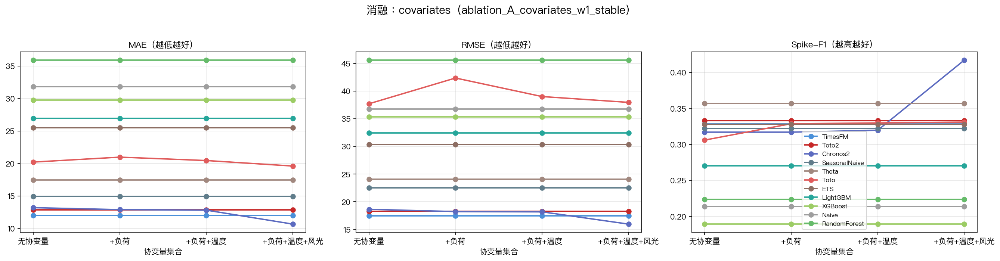

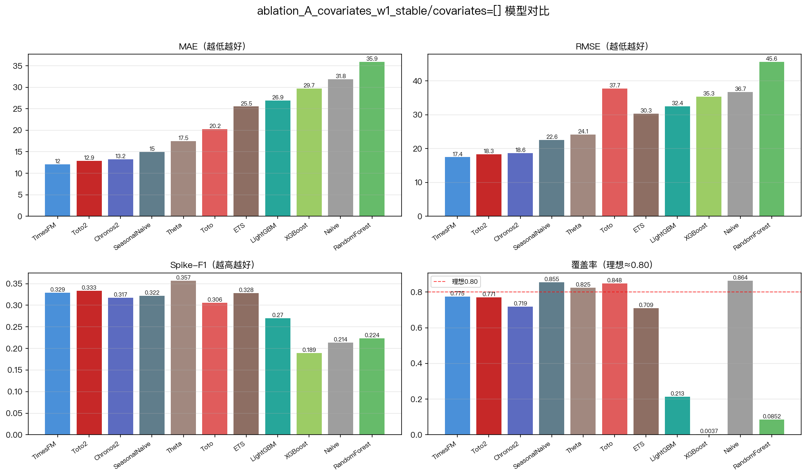

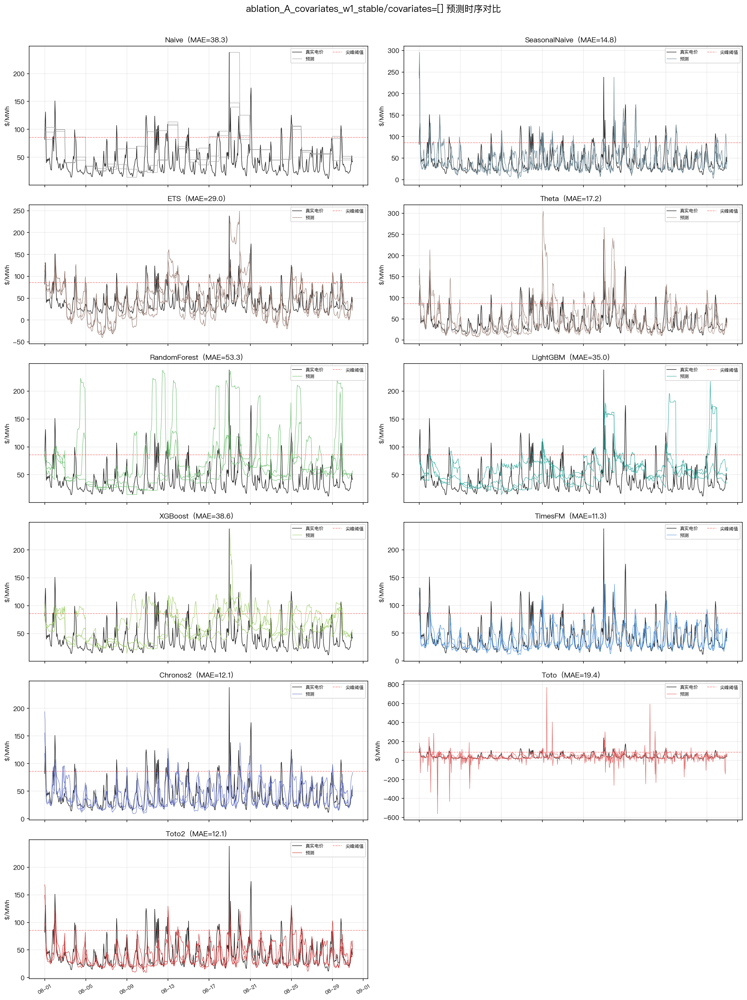

### W2 负价期的结果

| 协变量配置 | Chronos2 MAE | Chronos2 Spike-F1 | Toto2 MAE | Toto2 Spike-F1 |
|---|---|---|---|---|
| 无协变量 | 14.94 | 0.000 | 15.12 | 0.000 |
| +负荷（只加一个） | 15.33（↑2.6%，变差了） | 0.080 | 15.12（不变） | 0.000 |
| +负荷+温度+风光 | **11.35（↓24%）** | **0.250** | 15.12（不变） | 0.000 |

在 W2 负价期，情况完全不同：只加"负荷"这一个协变量时，Chronos2 反而变差了。但当把风光发电数据也加进来后，MAE 直接降了 24%，从 14.94 降到 11.35。

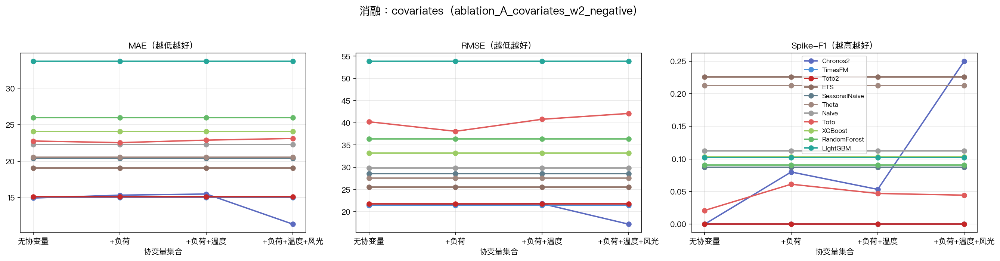

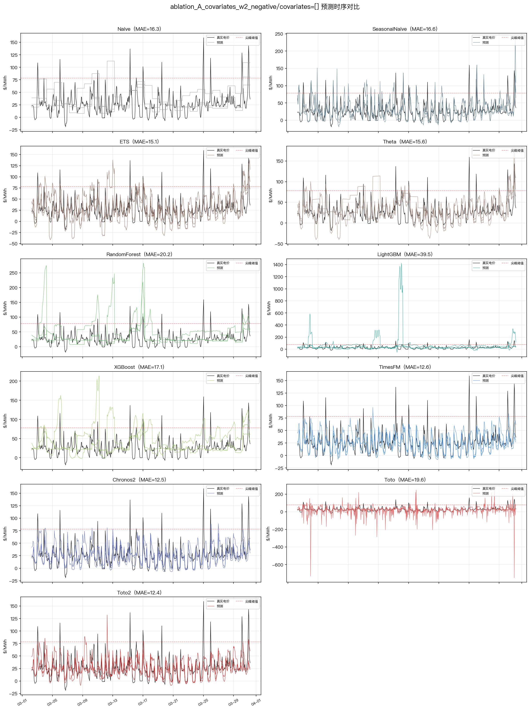

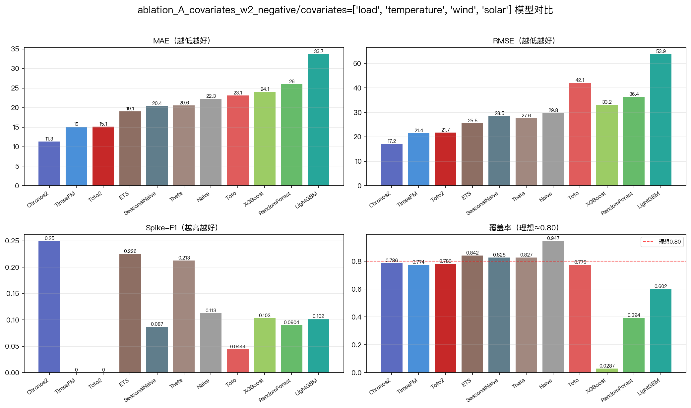

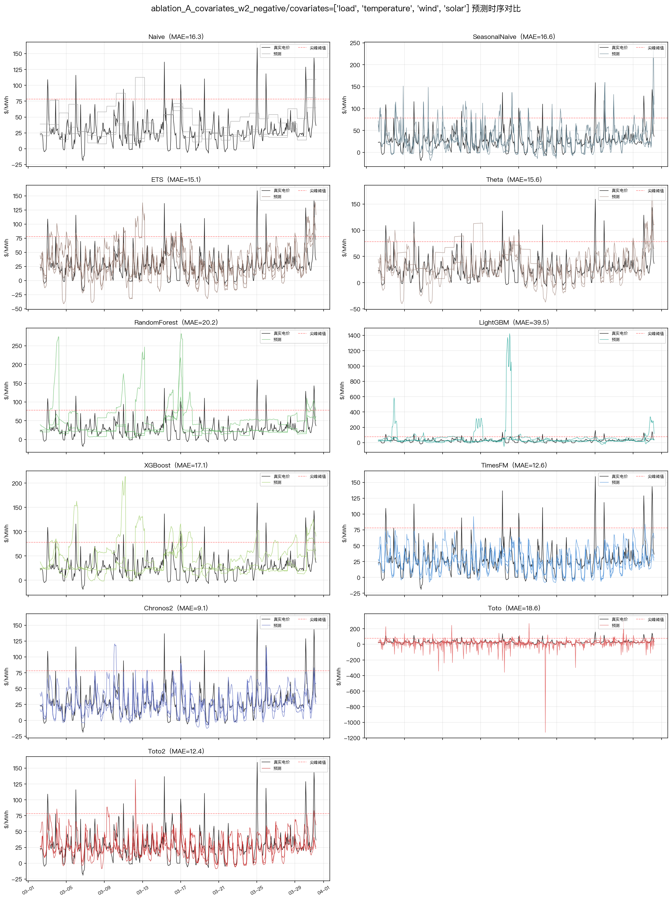

### 这个对比说明了什么

W2 的负电价本质上是"风光出力太多、供大于求"，所以只告诉模型负荷信息根本不对症，必须把风光数据加进来才能让它理解"为什么价格会变成负的"。这证明了**协变量的效果高度依赖市场状态**，需要对症下药。

同时，Toto2 在所有协变量配置下数值纹丝不动，因为它的架构根本不接收协变量输入。这就引出了一个重要问题：如果模型"吃不进去"外部信息，那它的性能天花板就完全取决于自身内部结构怎么处理纯时序信息——这正是后面结构消融要探究的事情。

---

## 三、例子 2：同一市场（W3 极端期），转动上下文长度旋钮

这个例子要说明的是：**不同模型对同一个旋钮的敏感度差异巨大，背后反映的是架构设计的区别。**

在 W3 极端尖峰期（冬天寒潮，价格剧烈跳升），我们把上下文长度从 7 天拨到 30 天：

### 数据对比

| 模型 | 7天 MAE | 30天 MAE | 改善幅度 | 7天 Spike-F1 | 30天 Spike-F1 |
|---|---|---|---|---|---|
| TimesFM | 31.47 | 30.85 | -2.0% | 0.660 | 0.685 |
| Chronos2 | 34.13 | 30.92 | -9.4% | 0.761 | 0.773 |
| **Toto2** | **38.29** | **30.60** | **-20.1%** | **0.742** | **0.773** |
| Toto 1.0 | 62.68 | 52.53 | -16.2% | 0.623 | 0.612 |

Toto2 从 7 天到 30 天，MAE 降了 20%，是所有模型中改善最大的。在 7 天时 Toto2 排名第三（MAE 38.29），落后 TimesFM 不少；但给它看 30 天历史后，三个模型几乎打平了（30.60 vs 30.85 vs 30.92，差距不到 1%）。

Spike-F1 方面更有意思：Toto2 在 30 天上下文下达到 0.773，和 Chronos2 完全相同，远超 TimesFM 的 0.685。

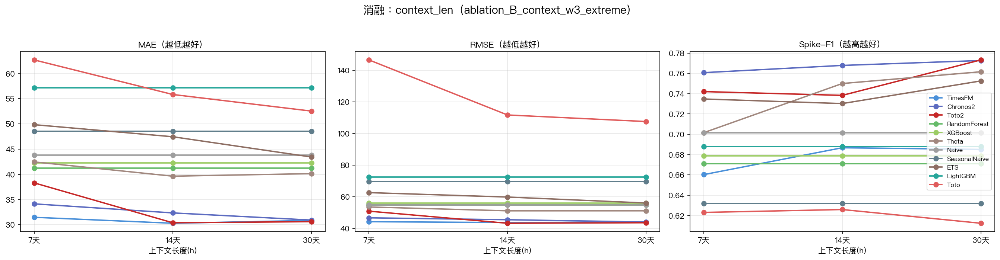

### 7 天上下文时的表现

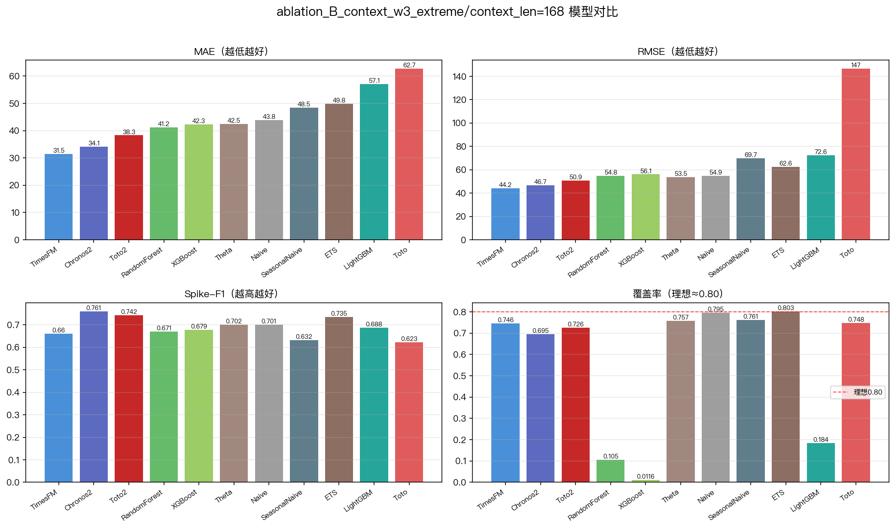

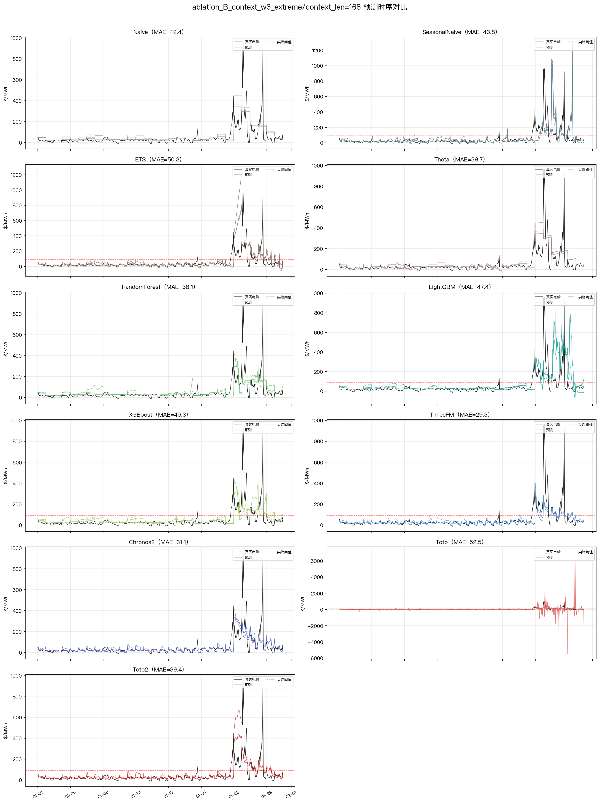

### 30 天上下文时的表现

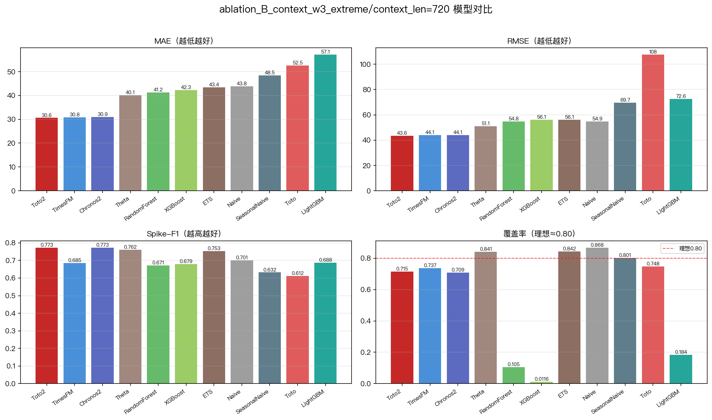

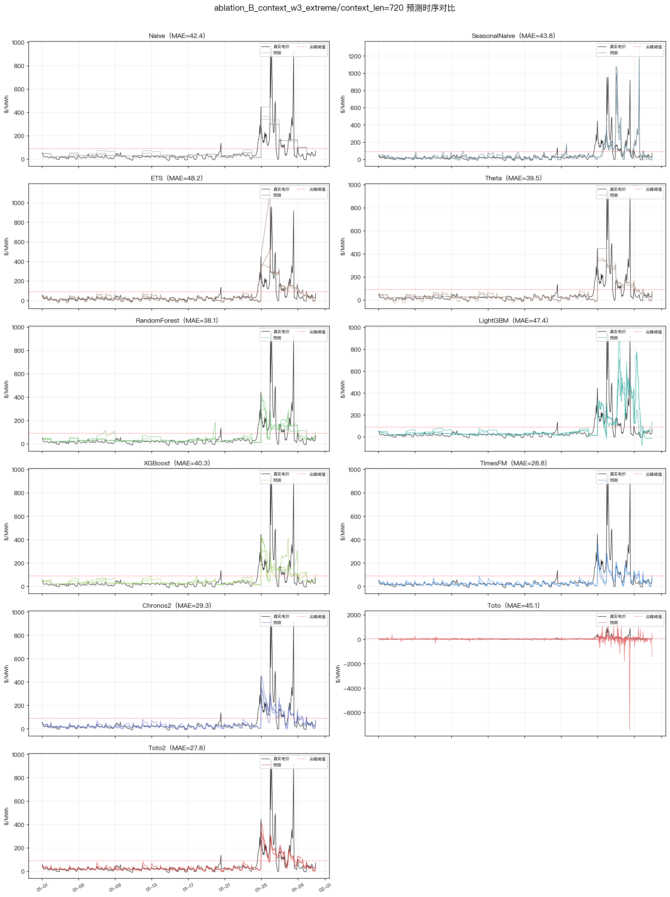

### 这个对比说明了什么

TimesFM 靠 7 天信息就已经够了（多看 23 天只提升了 2%），而 Toto2 明显"饥渴"于更长的历史——它需要更多上下文来学习极端事件的前兆模式，一旦信息给够了，性能就能追上甚至并列第一。

这背后是架构差异：TimesFM 用了非常高效的 patch 编码，短历史就能抓住主要模式；而 Toto2 的 CPM 架构更擅长从长序列中"慢慢积累"对极端事件的理解。这种"对历史长度的敏感度差异"直接对应着模型内部 attention 层和位置编码的工作方式——下一步结构消融就是要打开模型看看，到底是哪些层在利用这些额外的历史信息。

---

## 四、参数消融的整体结论

### 4.1 五个旋钮的影响力排序

把所有结果摊开来看，五个旋钮的"威力"大概是这样的：

| 旋钮 | 最大改善幅度 | 什么条件下效果最明显 |
|---|---|---|
| A - 协变量 | ↓24%（Chronos2, W2） | 协变量与市场状态"对症"时 |
| B - 上下文长度 | ↓20%（Toto2, W3） | 极端期 + Toto2 |
| F - 数据频率 | ↓18%（Toto2, W3 15min） | 极端期高频数据 |
| D - 预测步长 | 恶化 +13~20%（步长越长越差） | 所有模型都会衰减 |
| C - 多变量 | ≤1% 变化 | 影响很小，但至少不捣乱 |

**协变量是唯一能带来"大幅"提升的外部输入**，其他旋钮的影响基本在 20% 以内。而且协变量只对 Chronos2 有用，Toto2 和 TimesFM 根本不消费它。

### 4.2 三个基础模型各有什么特点

- **TimesFM**：整体 MAE 最低的稳定选手，对旋钮不太敏感（7 天历史就够了，不吃协变量），但长步长下 Spike-F1 会崩塌（168h 时降到 0.046）
- **Chronos2**：唯一能消费协变量的模型，加入全部协变量后在负价期和稳定期大幅领先；Spike-F1 在极端期最高（0.761）
- **Toto2**：对上下文长度和数据频率最敏感，给够信息后能追平其他模型；长步长下 Spike-F1 保持能力好（168h 时 0.233，远好于 TimesFM 的 0.046）

### 4.3 这些发现对后续研究有什么用

参数消融在整个研究中起到三个承上启下的作用：

**第一，确认了基础模型值得深入研究。** 三个基础模型在所有窗口中全面优于统计方法和树模型，说明"用预训练时序大模型做电价预测"这条路是对的。如果传统方法就够用了，后面的结构消融和融合模型就没有意义了。

**第二，锁定了性能瓶颈的位置。** 除了协变量（模型接口层面的问题）以外，其他旋钮带来的改善都有限（≤20%）。这说明"给模型什么输入"并不是决定性能的关键因素——真正的瓶颈在于"模型内部怎么处理这些信息"。比如 Toto2 为什么需要 30 天历史才能和 TimesFM 打平？它内部的哪些层在利用这些额外信息？哪些层可能是冗余的？这些问题就要靠结构消融来回答了。

**第三，为融合模型指明了方向。** 参数消融清楚地揭示了三个模型的互补性：Chronos2 有协变量消费能力但架构较重、TimesFM 短历史高效但尖峰能力弱、Toto2 长历史潜力大且步长鲁棒。理想的融合模型应该结合这三者的长处——比如用 Chronos2 的协变量接口、TimesFM 的高效 backbone、Toto2 的长步长稳定性。但要做到这种"取长补短"的融合，必须先搞清楚每个模型内部哪些组件负责哪些能力——这就是结构消融要揭示的信息，也是最终设计融合架构的依据。

简单来说：**参数消融告诉我们"天花板在哪"，结构消融告诉我们"瓶颈在哪"，融合模型则是"拿各家最好的零件拼出更强的整体"。** 三者是层层递进的关系。
