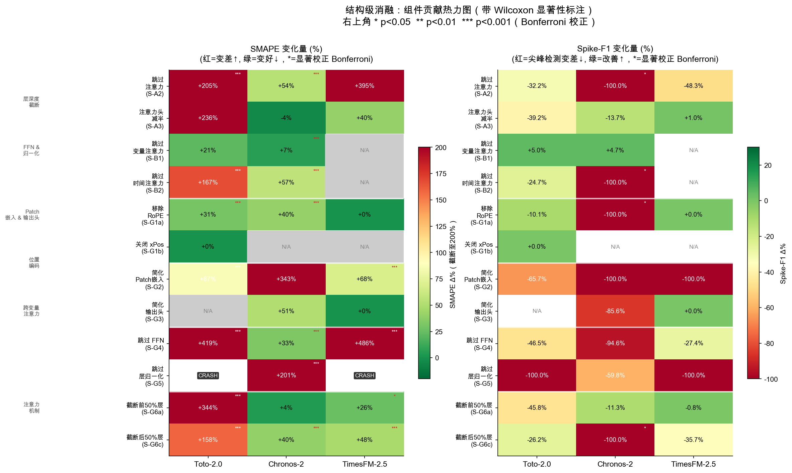
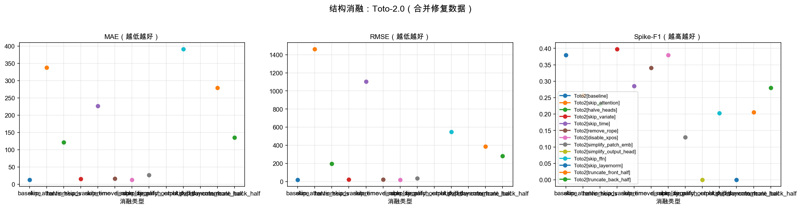
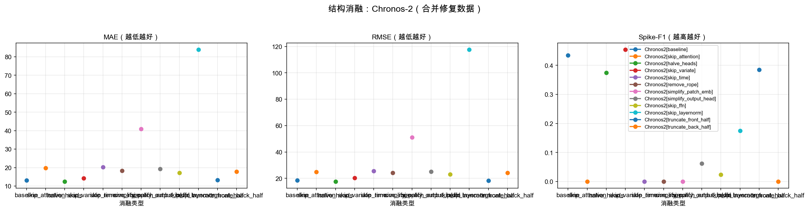
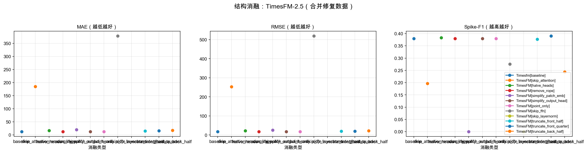
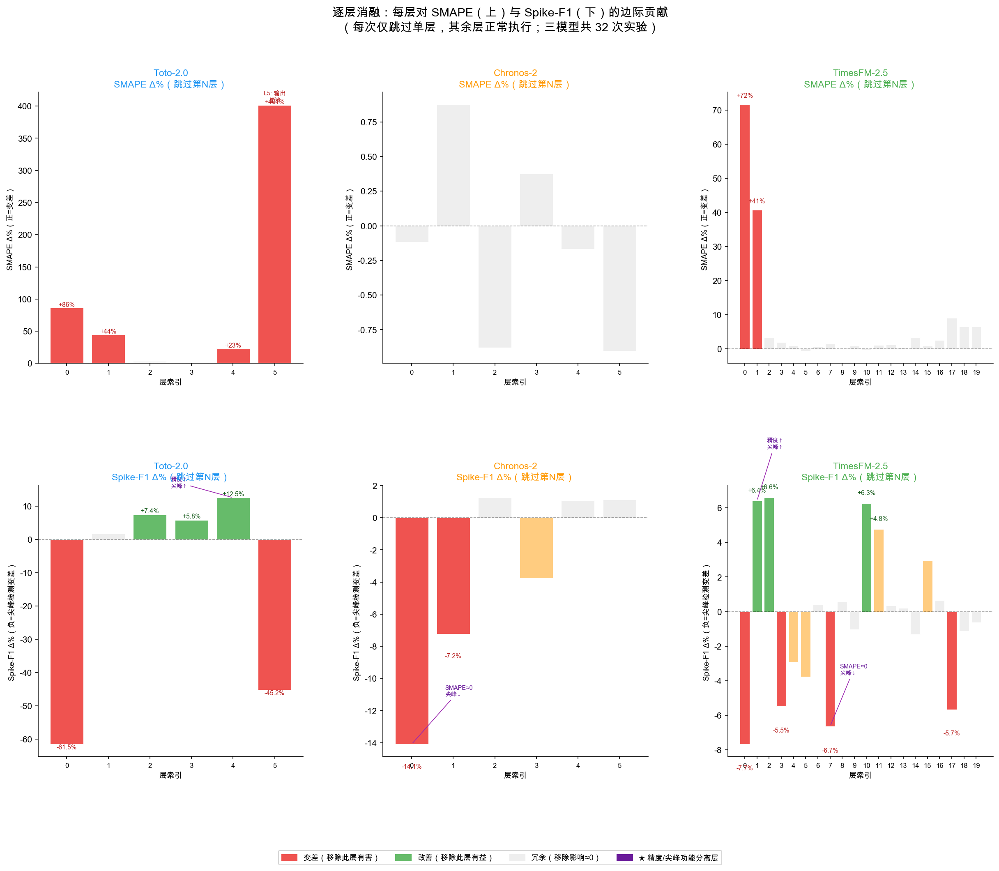
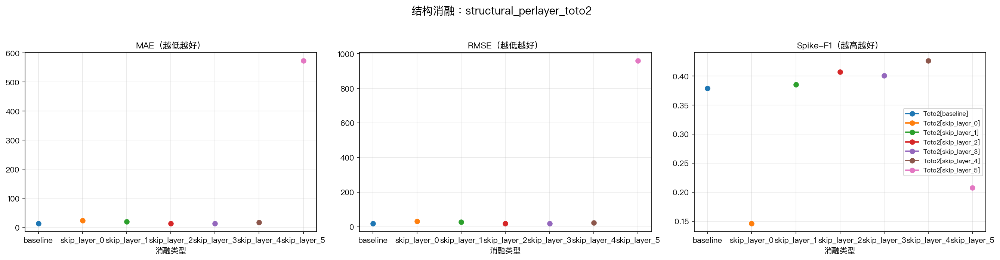
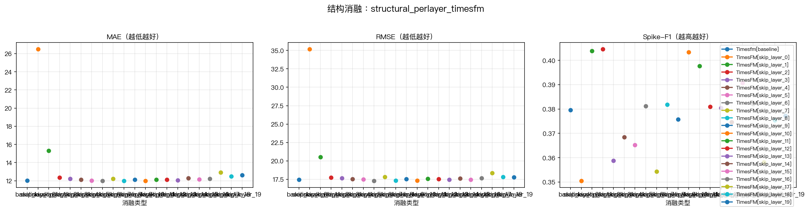
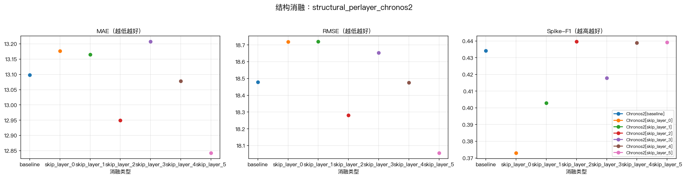
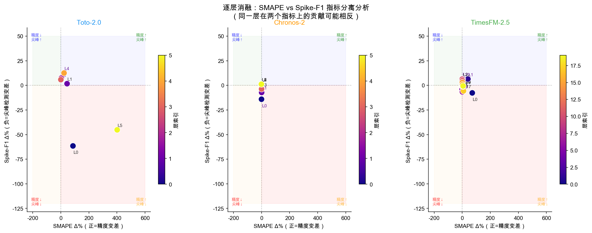
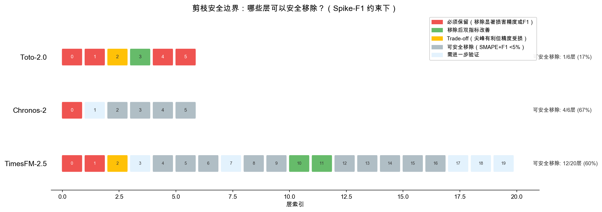

# 结构消融实验汇报

---

## 一、结构消融是怎么做的

参数消融回答了"给模型什么输入最好"，结构消融要回答的是下一个问题：**模型内部哪些零件真正在干活，哪些是摆设？**

做法很直观：**在不重新训练的前提下，对模型动"手术"**——把某个内部组件直接拿掉（替换成"什么都不做，原样传过去"的空操作），然后看模型的预测能力掉了多少。掉得越狠，说明这个零件越关键。

这种做法叫"消融研究"（ablation study），最早来自神经科学——通过切除动物大脑的某个区域来观察行为变化，从而推断该区域的功能（Meyes et al., 2019）。深度学习领域从 R-CNN（Girshick et al., 2014）开始广泛使用这个方法来分析模型各组件的贡献。

### 为什么我们知道该"切"哪里：Transformer 的标准积木结构

组件级消融之所以能做，是因为我们使用的三个基础模型（Toto2、Chronos2、TimesFM）都是 Transformer 架构。Transformer 最初由 Vaswani et al. (2017) 在 "Attention Is All You Need" 中提出，它有一个**明确且固定的积木结构**。

一个标准的 Transformer block 由以下固定组件构成：

| 组件 | 来源文献 | 功能 |
|---|---|---|
| Multi-Head Attention（多头注意力） | Vaswani et al. (2017) | 让每个时间步能"看到"其他时间步的信息 |
| FFN（前馈网络） | Vaswani et al. (2017)；SwiGLU 变体见 Shazeer (2020) | 对注意力的输出做非线性变换，是"记忆规律"的核心 |
| Layer Normalization（层归一化） | Ba et al. (2016) | 稳定数值范围，防止训练/推理时数字爆炸 |
| Positional Encoding（位置编码） | Vaswani et al. (2017)；RoPE 见 Su et al. (2021) | 告诉模型"这是第几个时间步"，赋予序列顺序感 |
| Patch Embedding（输入嵌入） | 各模型自行设计 | 把原始时间序列切片、压缩成模型能处理的格式 |
| Output Head（输出头） | 各模型自行设计 | 把内部表示转换成最终的预测值 |

所以"12 类手术"并非随意拼凑，而是**把 Transformer 架构图里所有能独立操控的功能模块穷举了一遍**。每种手术对应一类组件的关闭或简化操作。

### 两类手术

我们做了两种粒度的手术：

**组件级消融**（横向切）：把整类组件一次性拿掉。比如"把所有 FFN 全部跳过"、"把位置编码删掉"、"把注意力头减半"。总共定义了 12 类手术（覆盖上面所有组件类型及其子变体），每个模型根据自身架构做其中适用的那些（比如 TimesFM 没有"变量注意力"所以跳过这项，Toto2 的输出头结构特殊所以"简化输出头"不适用）。三个模型加起来共约 33 组有效实验。目的是搞清楚**哪类零件最重要**。

**逐层消融**（纵向切）：模型内部是一层一层堆叠的 Transformer block，我们逐层把单独一层替换成空操作（Identity），看这一层到底有没有在贡献。这种方法与近期 ShortGPT（Men et al., 2024）的思路类似——他们也发现大语言模型中大量层是冗余的，可以直接删除。Toto2 有 6 层、Chronos2 有 6 层、TimesFM 有 20 层，共 32 次实验。目的是搞清楚**模型里哪些层真的在干活**。

两者的关系：组件级回答"什么功能最重要"（是注意力重要还是 FFN 重要？），逐层回答"哪个位置最重要"（第几层是核心，第几层是摆设？）。两个视角合起来，才能为融合模型提供完整的设计依据。

### 评估方式

所有手术后的模型都在相同条件下（W1 稳定期，30 个起报点）跑完整回测，用两个指标打分：

- **SMAPE**：整体预测精度（类似 MAE 的百分比版本，方便跨数量级比较）
- **Spike-F1**：尖峰检出能力

为什么要用两个指标？因为参数消融已经暗示了"精度"和"尖峰检测"可能是不同的能力，如果只看一个会漏掉重要信息。事实证明这个设计是对的——后面会看到。

---

## 二、组件级消融：哪类零件最关键

### 总览

下图是三个模型的组件重要性热力图，颜色越深代表移除后退化越严重：

### 结论一句话：FFN 是核心引擎

三个模型里，移除 FFN 后全部"暴毙"：

| 模型 | 移除 FFN 后 SMAPE 退化 |
|---|---|
| Toto2 | +419%（从 30% 飙到 155%） |
| TimesFM | +486%（从 28% 飙到 162%） |
| Chronos2 | +33%（相对温和，但也是它最关键的组件之一） |

FFN 就是模型里负责"理解非线性规律"的部分——电价的跳变、不同价格区间的切换，靠的就是它。

### 具体例子：Toto2 的组件级消融

从图中可以看到 Toto2 各组件被移除后的退化程度。FFN 和前半层截断是最致命的两个操作。有趣的是 `disable_xpos`（关掉位置衰减机制）完全没有影响（退化 0%），说明这个组件在当前模型版本里就是摆设。

### Chronos2 的特殊现象：注意力头减半反而变好了

| 操作 | Chronos2 SMAPE 变化 |
|---|---|
| 注意力头从 8 个减到 4 个 | **-4%（改善了）** |

这说明 Chronos2 的注意力机制有"过剩"——8 个头里有些互相干扰，减到 4 个反而更清爽。但注意：Toto2 做同样的操作会暴跌 236%，TimesFM 也会退化 +40%，所以这不是通用结论，只是 Chronos2 的特殊现象。

### TimesFM 的组件消融

TimesFM 最突出的特点是：移除注意力后退化 +395%（三个模型中最依赖注意力的），同时输出头也不能简化（简化后 +88%）。说明 TimesFM 的强大来源于"高效的注意力 + 精心设计的输出头"这个组合。

---

## 三、逐层消融：模型里每一层都在干活吗？

### 总览

下图是三个模型逐层消融的曲线，横轴是层号，纵轴是移除该层后指标的变化：

### 例子 1：Toto2 的"沙漏型"结构

Toto2 只有 6 层，逐层移除后的表现：

| 层 | SMAPE 退化 | Spike-F1 变化 | 这层在干什么 |
|---|---|---|---|
| L0（第一层） | +86% | **-62%** | 最关键：尖峰编码的核心来源 |
| L1 | +44% | +2% | 精度层，对尖峰无所谓 |
| L2 | +4% | +7% | 冗余，拿掉几乎没影响 |
| L3 | +0.2% | +6% | 冗余，拿掉几乎没影响 |
| L4 | +23% | **+12.5%** | 有意思：拿掉后精度变差但尖峰检测变好了 |
| L5（最后一层） | +402% | -45% | 输出层，拿掉直接崩溃 |

Toto2 就像一个沙漏：**两头极关键（L0 负责编码尖峰信号，L5 负责输出），中间可以大幅精简**。L2 和 L3 基本是摆设。

### 例子 2：TimesFM 的 20 层里 40% 严格冗余

TimesFM 有 20 层，但逐层消融发现只有 3 个"锚点"层真正不可或缺：

| 关键层 | SMAPE 退化 | Spike-F1 变化 | 角色 |
|---|---|---|---|
| L0 | +72% | -8% | 双重关键：精度和尖峰都靠它 |
| L7 | +2% | **-7%** | "隐性尖峰层"：精度不变但尖峰能力大降 |
| L17 | +9% | -6% | 深层锚点：精度和尖峰都有贡献 |

在严格双指标标准（|SMAPE|<3% 且 |F1|<3%）下，有 8 层（40%）可安全移除；如果用稍宽松的标准，还有更多层处于边缘地带。换句话说，**TimesFM 200M 参数的 20 层深度，在电价预测这个具体任务上确实"过大"了**——但并非所有中间层都是完全无用的，有些层有微弱但不可忽略的贡献。

### 例子 3：Chronos2 的"隐性尖峰层"

Chronos2 的 L0 是最有意思的发现之一：

| 指标 | 移除 L0 后的变化 |
|---|---|
| SMAPE | -0.1%（几乎没变，看起来完全冗余） |
| Spike-F1 | **-14%（尖峰检出能力暴跌）** |

如果只看 SMAPE，你会觉得"L0 没用，可以删"。但一看 Spike-F1 就知道：L0 是整个模型尖峰检测能力的核心来源，只是它不参与日常精度的计算。这就是为什么我们必须用两个指标——**单一指标会让你做出错误的剪枝决策**。

---

## 四、最重要的发现："精度通路"和"尖峰通路"是分开的

这是整个结构消融中最关键的发现，值得单独拿出来讲。

传统理解中，模型的每一层都统一为最终输出服务。但我们发现：**有些层专门负责"日常精度"，有些层专门负责"尖峰检测"，两者之间甚至存在冲突。**

上图中，横轴是移除某层后 SMAPE 的变化，纵轴是 Spike-F1 的变化。如果所有层都统一服务于一个目标，点应该集中在左下角（移除后两个指标一起变差）或右上角（两个指标一起变好）。但实际上有很多点出现在**左上角**（精度变差但尖峰变好）或**右下角**（精度没事但尖峰暴跌），说明两个功能确实是由不同的层分工承担的。

具体的功能分离例子：

| 层 | 模型 | 精度（SMAPE）变化 | 尖峰（Spike-F1）变化 | 说明 |
|---|---|---|---|---|
| L4 | Toto2 | +23%（变差） | **+12.5%（变好）** | 这层在"平滑"输出，压制了尖峰信号 |
| L0 | Chronos2 | ≈0%（无变化） | **-14%（暴跌）** | 纯粹的尖峰层，不参与精度 |
| L7 | TimesFM | ≈0%（无变化） | **-7%（下降）** | 隐性尖峰层 |
| L10 | TimesFM | ≈0%（无变化） | **+6%（移除反而好）** | 尖峰干扰层，存在反而有害 |

这个发现的实际意义是：**做模型剪枝（精简模型）时，绝对不能只看 MAE/SMAPE 来决定哪些层可以删**。必须同时约束尖峰检测能力，否则精简后的模型可能日常预测很准，但完全丧失了对极端事件的预警能力。

---

## 五、三个模型的"体质"差异

逐层消融还揭示了三个模型完全不同的内部结构模式。下图用更保守的双指标标准来判定每一层的安全性——**仅当移除后 |SMAPE 变化| < 3% 且 |Spike-F1 变化| < 3% 同时满足，才标记为"可安全移除"**：

| 模型 | 总层数 | 严格安全层 | 边缘层 | 敏感层 | 结构模式 |
|---|---|---|---|---|---|
| Toto2 | 6 | 0 层（0%） | 0 层 | 2 层 | 沙漏型：几乎每一层都不可或缺 |
| Chronos2 | 6 | 3 层（50%） | 1 层 | 1 层 | 均匀型：一半的层可以安全删除 |
| TimesFM | 20 | 8 层（40%） | 2 层 | 7 层 | 前端主导型：大量中间层冗余 |

图中颜色含义：深红 = 必须保留（SMAPE>10% 或 F1<-10%）；浅红 = 敏感（SMAPE>5% 或 |F1|>5%）；深绿 = 双指标改善（移除反而更好）；浅绿 = 可安全移除；橙色 = 边缘（需要黑盒试验验证）。

几个关键观察：

- **Toto2 最"紧凑"**——6 层里没有一层能按严格标准安全移除，每一层都有不可忽略的贡献。这说明 Toto2 虽然参数量最小（22M），但内部结构效率最高，没有明显浪费。
- **Chronos2 有一半冗余**——L2-L4 三层（50%）可以安全删掉，但 L0 绝对不能动（隐性尖峰层）。
- **TimesFM 冗余最严重**——20 层中 8 层（40%）按严格双指标标准可安全移除，如果放宽到边缘层则更多。200M 参数在电价预测这个任务上确实"过大"了。

一个直观的结论：**融合模型不需要 20 层这么深的架构**。综合三个模型的剪枝结果，6-8 层的精简架构加上精心选择的关键组件，就足以覆盖电价预测所需的能力。

---

## 六、结构消融的整体结论

### 6.1 回答了什么问题

参数消融发现"性能瓶颈不在输入端，而在模型内部"。结构消融进一步定位了瓶颈具体在哪里：

- **FFN 是所有模型最关键的组件**，负责理解电价的非线性跳变。三个模型移除 FFN 后全部严重退化。
- **位置编码（RoPE）不可或缺**，它帮助模型理解"一天中哪个时段容易出现尖峰"这种周期性信息。移除后 Chronos2 的尖峰检测能力直接归零。
- **大量层是冗余的**，尤其是 TimesFM（20 层里严格标准下 40% 可安全删掉）。这些通用大模型在电价预测这个具体任务上明显"过大"了。
- **"精度"和"尖峰检测"是两条不同的通路**，由不同的层分工负责，甚至存在冲突。

### 6.2 对融合模型有什么用

结构消融为融合模型提供了"零件清单"——我们现在知道每个模型最好的零件是什么：

| 来源模型 | 值得复用的零件 | 原因 |
|---|---|---|
| Toto2 | SwiGLU FFN 设计 | 移除后退化最严重（+419%），是三模型中 FFN 效率最高的 |
| Toto2 | 前层浅编码策略 | 仅用第一层就完成了核心尖峰信号编码 |
| Chronos2 | "纯尖峰检测层"的设计思路 | L0 不影响精度但独立承担尖峰检测，功能分离最干净 |
| Chronos2 | 精简注意力头数 | 头数减半不仅无害还改善，说明可以更轻量 |
| TimesFM | 3 锚点精简配置 | 20 层精简到 5-6 层仍可工作，验证了"少而精"的可行性 |
| TimesFM | 残差输出头设计 | 简化输出头后 +88%，说明输出头的复杂设计有其必要性 |

融合模型的设计思路就是：**从三个模型中各取最好的零件，拼成一个 6-7 层的精简架构**——用 Toto 的 FFN 处理非线性、借鉴 Chronos 的尖峰检测层设计、参考 TimesFM 的"少量关键层 + 精心输出头"的高效路线。

### 6.3 三步递进关系

整个研究的逻辑链现在完整了：

**参数消融** → 确认基础模型远优于传统方法，并且"给模型什么输入"的改善空间有限（≤20%）。瓶颈不在输入端。

**结构消融** → 打开模型内部看，定位了具体哪些组件/层是性能的核心来源、哪些可以精简，并发现了"精度通路 vs 尖峰通路"的功能分离现象。

**融合模型**（下一步） → 基于前两步的发现，从三个模型中取其精华零件，设计一个针对电价预测任务优化的紧凑架构，目标是同时具备强精度和强尖峰检测能力。

---

## 参考文献

- Vaswani, A., Shazeer, N., Parmar, N., et al. (2017). "Attention Is All You Need." *NeurIPS 2017*. [arXiv:1706.03762](https://arxiv.org/abs/1706.03762) — Transformer 架构原始论文，定义了多头注意力、FFN、位置编码等标准组件结构。
- Ba, J. L., Kiros, J. R., & Hinton, G. E. (2016). "Layer Normalization." [arXiv:1607.06450](https://arxiv.org/abs/1607.06450) — 层归一化方法，Transformer 中用于稳定各层数值范围的核心机制。
- Su, J., Lu, Y., Pan, S., et al. (2021). "RoFormer: Enhanced Transformer with Rotary Position Embedding." [arXiv:2104.09864](https://arxiv.org/abs/2104.09864) — RoPE 旋转位置编码，被 Toto2 和 Chronos2 采用。
- Shazeer, N. (2020). "GLU Variants Improve Transformer." [arXiv:2002.05202](https://arxiv.org/abs/2002.05202) — 提出 SwiGLU 等 FFN 激活函数变体，Toto2 采用的 SwiGLU FFN 即来源于此。
- Men, X., Xu, M., Zhang, Q., et al. (2024). "ShortGPT: Layers in Large Language Models are More Redundant Than You Expect." *ACL 2025 Findings*. [arXiv:2403.03853](https://arxiv.org/abs/2403.03853) — 发现大模型中大量层冗余可直接删除，与我们逐层消融的发现一致。
- Meyes, R., Lu, M., de Puiseau, C. W., & Meisen, T. (2019). "Ablation Studies in Artificial Neural Networks." [arXiv:1901.08644](https://arxiv.org/abs/1901.08644) — 消融研究方法论综述，追溯了从神经科学到深度学习的方法迁移。
- Girshick, R., Donahue, J., Darrell, T., & Malik, J. (2014). "Rich Feature Hierarchies for Accurate Object Detection and Semantic Segmentation." *CVPR 2014*. — 首次在深度学习论文中明确使用 "ablation study" 术语的里程碑工作。
- Ansari, A., Shchur, O., et al. (2025). "Chronos-2: From Univariate to Universal Forecasting." [arXiv:2510.15821](https://arxiv.org/abs/2510.15821) — Chronos2 模型论文（Amazon），支持协变量输入的时序基础模型。
- DataDog (2025). "Toto 2.0: Time Series Forecasting Enters the Scaling Era." [arXiv:2605.20119](https://arxiv.org/abs/2605.20119) — Toto2 模型论文，采用 SwiGLU FFN + RoPE 的多变量时序基础模型。
- Das, A., Kong, W., Sen, R., & Zhou, Y. (2024). "A Decoder-Only Foundation Model for Time-Series Forecasting." *ICML 2024*. — TimesFM 模型论文（Google），200M 参数的仅解码器时序基础模型。
- Liang, J., et al. (2025). "Foundation Models for Time Series: A Survey." [arXiv:2504.04011](https://arxiv.org/abs/2504.04011) — 时序基础模型综述，系统梳理了 Transformer 在时序预测领域的应用。
